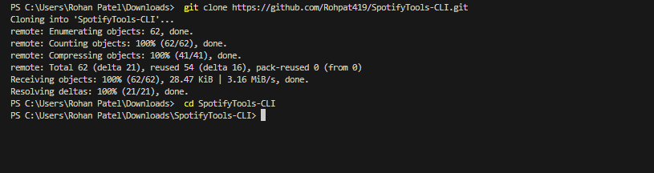
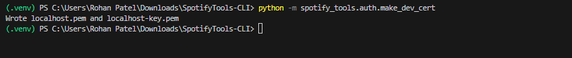
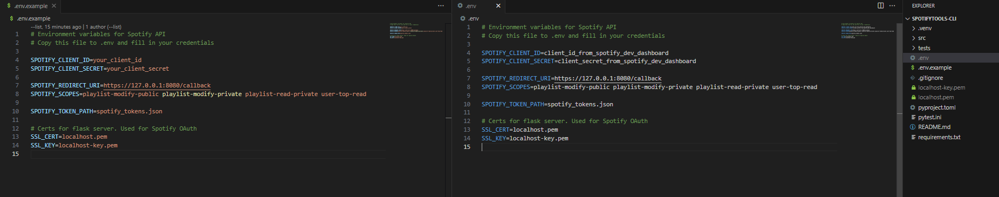
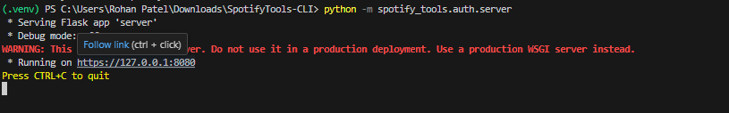
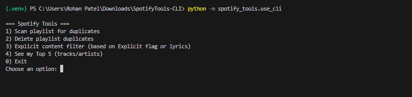

# SpotifyTools
Some tools that I thought would be useful for my Spotify experience that weren't built into the app. 

## Features

- **Duplicate Cleaner**: Remove duplicate songs from your playlists.

This is not a native spotify feature and was the first tool that I wanted to create for this project. The idea was first realized years ago in a super messy script. Now it exists as part of the semi-decent terminal app you see here. 


- **Explicit Content Filter**: Remove explicit content from your playlists.


- **Top Artists/Tracks**: Get a list of your top artists or tracks.


## How to Use


1. Clone the repository, set up Python environment:
   ```bash
    git clone https://github.com/Rohpat419/SpotifyTools-CLI.git
    cd SpotifyTools-CLI
    
    python -m venv .venv
    # On windows, allow scripts to run
    Set-ExecutionPolicy -Scope Process -ExecutionPolicy Bypass
    .\.venv\Scripts\activate # On macOS/Linux use `source .venv/bin/activate`
    pip install -e .
    ```



2. Generate local certs for redirect URI:
 
 This is so your browser doesn't freak out when you authorize the app to access your Spotify account. The app needs this authorization to modify your playlists or read your top tracks/artists and private playlists.

   ```bash
    python -m spotify_tools.auth.make_dev_cert 
   ```



This will create a localhost.pem and localhost-key.pem file in the root directory. 
&nbsp;

3. Fill out the environment variables in a .env file in the root directory:

Copy the .env.example file and fill in your SPOTIFY_CLIENT_ID and SPOTIFY_CLIENT_SECRET, you can get these by creating an app in the [Spotify Developer Dashboard](https://developer.spotify.com/dashboard/applications). 

Rename the copied file to `.env`. Like so: 



&nbsp;

4. Get a refresh token that will be used for modifying playlists or reading private data (top tracks/artists, private playlists). You will need to log in to your Spotify account and authorize the app to access your data.

    ```bash
    python -m spotify_tools.auth.server
    ```

This will create a `spotify_tokens.json` file in the root directory that will be used to authenticate requests.




&nbsp;

5. Run the application: 

    ```bash
    python -m spotify_tools.use_cli
    ```

Now feel free to explore the different features this app has to offer, the CLI will guide you through the rest!



## Next Steps: 
1. Make a frontend for the app. A terminal app is not the most user friendly. If I can host the frontend as this can make the user experience easier than having them set up the environment themselves. 
2. convert the scripts into a real backend that can serve API requests. Then hook up the frontend to the backend. This backend needs to be hosted somewhere like render.com. 
3. Conduct a security review. Checking if tokens/keys are ever leaked. The refresh token is stored in plaintext on the user's computer which is already a flaw. This was considered OK since this is a dev POC typa project. 
